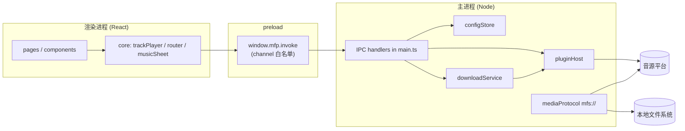
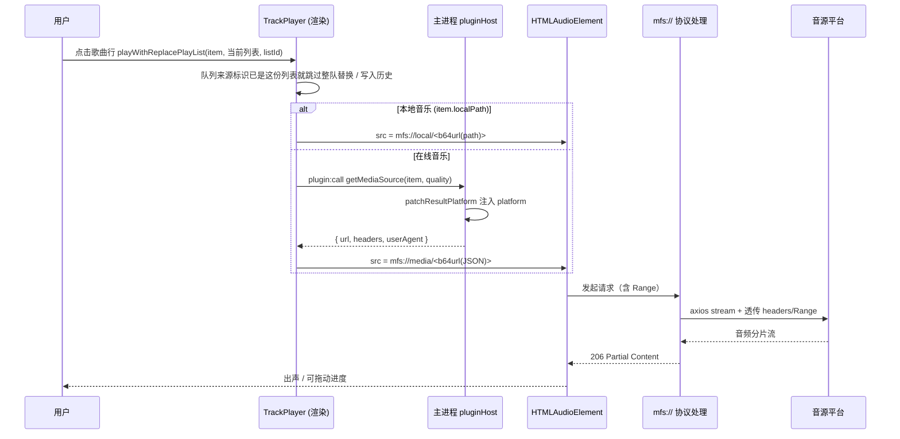

# MusicFree Desktop 开发指南

> 适用版本：v1.0.0 · 技术栈：Electron 33 + React 18 + TypeScript 5 + Vite 6
> 目标平台：macOS (arm64)
> 阅读顺序建议：第 1–4 章通读建立全局观，第 5 章按需精读，第 6 章日常开发查手册，第 8 章动代码前必看。

---

## 目录

1. [项目定位与设计取向](#1-项目定位与设计取向)
2. [环境搭建与运行构建](#2-环境搭建与运行构建)
3. [目录与模块地图](#3-目录与模块地图)
4. [进程模型与核心数据流](#4-进程模型与核心数据流)
5. [核心机制详解](#5-核心机制详解)
6. [常见开发任务（How-To）](#6-常见开发任务how-to)
7. [音源插件开发规范](#7-音源插件开发规范)
8. [约定与坑点清单](#8-约定与坑点清单)
9. [已知问题与路线图](#9-已知问题与路线图)
10. [调试手册](#10-调试手册)

---

## 1. 项目定位与设计取向

MusicFree Desktop 是 MusicFree 移动端的 macOS 桌面端重写实现。它有两层目标：

1. **交互层**参照网易云音乐 macOS 客户端重构：左侧边栏 + 顶部标题栏（红绿灯内嵌 / 搜索框）+ 底部播放条 + 大封面歌词的正在播放页。
2. **能力层**与 MusicFree 移动端的音源插件（`.js`）**二进制级兼容**——插件在主进程沙箱中运行，可用依赖白名单与移动端完全一致。

由此衍生出三条贯穿全项目的设计约束，理解它们能解释很多代码里"看起来绕"的写法：

| 约束 | 具体表现 |
| --- | --- |
| **渲染进程零 Node 权限** | `nodeIntegration: false` + `contextIsolation: true`，渲染进程只能通过 `window.mfp.invoke` 走白名单 IPC |
| **插件只在主进程跑** | 插件的 `Function` 沙箱、网络请求、Cookie 处理全部在主进程，渲染进程只拿 JSON 结果 |
| **媒体流量必须绕过 CORS 与风控** | 自建 `mfs://` 协议代理远程音频流，携带插件返回的 Referer / UA / 自定义头，并透传 Range 以支持拖进度 |

### 技术选型

| 领域 | 选择 | 理由 |
| --- | --- | --- |
| 状态管理 | jotai（原子化） | 与移动端同构，天然支持"模块外的 store 写入"（`getDefaultStore()`），无需 Provider |
| 事件总线 | eventemitter3 | 播放器内核 `TrackPlayer` 用它对外广播 |
| 路由 | 自研栈式路由 | 只需"前进/后退/replace"，引入 react-router 反而重 |
| 样式 | 纯手写 CSS + CSS 变量 | 无 CSS-in-JS 运行时开销，主题切换只改变量 |
| 元数据解析 | music-metadata | 纯 JS，读 ID3 / FLAC 标签与内嵌封面 |
| 打包 | vite（渲染） + esbuild（主进程） | 主进程两文件，esbuild 秒级编译，无需 webpack |

---

## 2. 环境搭建与运行构建

### 依赖安装

```bash
npm install
```

国内网络若卡在 Electron 二进制下载，先切镜像：

```bash
npm config set electron_mirror https://npmmirror.com/mirrors/electron/
```

### npm scripts 全貌

| 命令 | 作用 |
| --- | --- |
| `npm run dev` | 开发模式：`concurrently` 同时起 vite(5173) + esbuild watch（主进程）+ electron |
| `npm run dev:renderer` | 只起 vite（渲染进程热更新） |
| `npm run dev:main` | 只跑 esbuild watch，输出 `dist-electron/` |
| `npm run dev:electron` | `wait-on tcp:5173` 后以 `ELECTRON_START_URL` 启动 Electron |
| `npm run build:renderer` | vite 构建 → `dist-renderer/` |
| `npm run build:main` | esbuild 压缩构建主进程 → `dist-electron/` |
| `npm run build:main:debug` | 同上但不压缩、**带 sourcemap**（给断点调试用） |
| `npm run debug:main` | 构建 + 以 `--inspect=9229` 启动，可给主进程打断点（详见 §10.5） |
| `npm run build` | 上面两步串联 |
| `npm start` | 以生产构建运行（`loadFile dist-renderer/index.html`） |
| `npm run dist` | build + electron-builder 出 dmg |
| `npm run dist:dir` | build + 出未打包的 `.app` 目录（调试打包问题更快） |
| `npm run reinstall` | 构建并覆盖安装到 `/Applications` 后启动（详见下一节） |
| `npm run reinstall:dmg` | 同上，但额外产出 dmg |

### 开发模式的工作方式

`dev` 模式不重启 Electron 就能改渲染进程代码（vite HMR）；改 `electron/**` 会被 esbuild watch 编译，但**需要手动重启 Electron 进程**才生效（脚本没有做 main 进程热重载）。

判断当前跑的是哪种模式，看主进程 `main.ts`：

```ts
if (process.env.ELECTRON_START_URL) {
    mainWindow.loadURL(process.env.ELECTRON_START_URL);   // dev
} else {
    mainWindow.loadFile(path.join(__dirname, "../dist-renderer/index.html")); // prod
}
```

### 打包

`package.json` 的 `build` 字段已配置 electron-builder：

- 产物目录 `release/`（Windows 另见下面的 `release-win/`）
- macOS：打 arm64 的 dmg；Windows：打 x64 的 nsis 安装包
- `mac.identity: null` → **跳过代码签名**，本机自用可跑，分发给他人会被 Gatekeeper 拦截（Windows 侧同理，未配证书）

```bash
npm run dist      # macOS：产出 release/MusicFreeDesktop-1.0.0-arm64.dmg
npm run dist:win  # Windows：产出 release-win/MusicFreeDesktop-Setup-1.0.0.exe
```

### 重装自测（构建 → 覆盖安装 → 启动）

改完代码想在实际安装形态下验证时，用这条：

```bash
npm run reinstall            # 只出 .app，快，日常自测用
npm run reinstall:dmg        # 额外产出 dmg，慢，要分发时用
```

脚本在 `scripts/reinstall.sh`，做四件事：

1. 用 `osascript` 请应用退出，并轮询 `pgrep -x` 确认进程真的没了（最多等 10 秒，超时则 `pkill`）——不确认就删，`/Applications` 里的包会被占用导致覆盖失败
2. `npm run dist:dir` 构建，**完整日志写入 `$TMPDIR/musicfree-dist.log`**
3. `rm -rf` 旧包后用 `ditto` 拷贝新包到 `/Applications`（`ditto` 比 `cp -R` 更适合 `.app`：保留权限、符号链接与扩展属性）
4. `open` 启动

替换 `/Applications` 里的 `.app` **不影响用户数据**——歌单、插件、下载记录都在 `~/Library/Application Support/MusicFreeDesktop/`，重装后照旧。

#### 为什么不用"`npm run dist | grep -c error` 判断成败"

这是一种常见写法，但**逻辑是反的**，容易长期误导：

```bash
# 反例，不要用
npm run dist 2>&1 | grep -ciE " error" && rm -rf /Applications/xxx.app && cp -R ...
```

两个问题（均已实测）：

| 问题 | 原因 | 后果 |
| --- | --- | --- |
| 逻辑取反 | `grep -c` 打印数字，但**退出码遵循 grep 规则**：无命中返回 1 | 构建**成功**（0 条 error）时 `&&` 短路，安装与启动全被跳过，你以为装了新版其实还是旧版 |
| 漏判报错 | 模式 `" error"` **带前导空格**，行首的 `ERROR: ...` 不匹配 | 真实报错被漏掉 |

正确做法是看命令自己的退出码（`set -o pipefail` 后用管道整体退出码，或 `PIPESTATUS[0]`），要留日志用 `tee` 而不是把日志丢给 `grep`。

### Windows 打包与安装（NSIS）

`npm run reinstall` 是 macOS 专用（`osascript` + `/Applications` + `ditto`），Windows 上走 NSIS：

```powershell
$env:ELECTRON_BUILDER_BINARIES_MIRROR = "https://npmmirror.com/mirrors/electron-builder-binaries/"
npm run dist:win     # 产出 release-win\MusicFreeDesktop-Setup-1.0.0.exe
```

双击安装包即可完成安装（**免管理员**），装到 `%LOCALAPPDATA%\Programs\MusicFreeDesktop`，并自动创建桌面与开始菜单快捷方式；卸载走同目录的 `Uninstall MusicFreeDesktop.exe`，`deleteAppDataOnUninstall: false` 保证卸载不删用户数据。

`nsis` 配置的几个选择：

| 配置 | 值 | 原因 |
| --- | --- | --- |
| `perMachine` | `false` | 装到用户目录，不需要 UAC；本项目的开发会话也没有管理员权限，装到 `Program Files` 无法覆盖 |
| `oneClick` | `false` + `allowToChangeInstallationDirectory` | 给一个可选安装路径的向导，比静默安装更好排查 |
| `shortcutName` | `MusicFree` | 与窗口标题一致，不用包名 `MusicFreeDesktop` |
| `artifactName` | `MusicFreeDesktop-Setup-${version}.exe` | 与 mac 的 dmg 命名风格一致 |

> **为什么 Windows 产物在 `release-win/` 而不是 `release/`**：`release` 目录里曾出现 `app.asar` 被进程长期占用，`electron-builder` 删旧产物时报 `EBUSY: unlink`（连目录改名都是"访问被拒绝"）。既然 `build.files` 是白名单，输出目录换到哪都不影响内容，就单独给了 Windows 一个目录。`release/` 仍是 macOS 的产物目录。
>
> 另外两条踩过的坑：**打包时不要同时去读产物目录里的 `app.asar`**（哈希、扫描都会把文件占住，直接让打包 EBUSY 失败）；`electron-builder` 的短参 `-c.directories.output=xxx` 会被当配置文件路径解析，必须写全 `--config.directories.output=xxx`。

> 本机另有一份历史遗留的 `C:\Program Files\MusicFreeDesktop`（早期手工复制的安装，当时的开发会话没有管理员权限写不进去）。它与 NSIS 装的那份**共用** `%APPDATA%\musicfree-desktop\store.json`，**不要同时运行**；需要更新它时用 `.workbuddy\update-program-files.ps1`（自提权）。

---

## 3. 目录与模块地图

```
electron/                        主进程（Node 环境，可读写文件与网络）
  main.ts                        窗口创建、IPC 路由表、外部链接拦截、渲染进程日志转发
  preload.ts                     contextBridge 暴露 window.mfp（含 channel 白名单）
  services/
    pluginHost.ts                插件宿主：Function 沙箱 + 依赖白名单 + 平台注入
    mediaProtocol.ts             mfs:// 协议：远程音频流代理 / 本地文件流
    configStore.ts               userData/data/store.json 键值持久化
    sessionStore.ts              上次播放会话（当前歌曲/进度/队列）→ userData/data/session.json
    localMusic.ts                本地文件夹扫描、ID3/FLAC 元数据与内嵌封面
    builtinMusic.ts              内置示例曲目（Node 合成 WAV + SVG 封面）
    downloadService.ts           下载队列（并发 2）、进度事件、任务持久化
    cacheManager.ts              缓存占用统计与按类清理
    mediaCache.ts                播放缓存（LRU，上限可配）
    mediaDownloader.ts           上游 → .part → 播放器的两端解耦下载器
    coverCache.ts                封面落盘与短链（mfs://cover/），含残留清理
    backupService.ts             备份与恢复：组装/校验/应用 + 本地文件 + WebDAV

src/                             渲染进程（浏览器环境，无 Node）
  main.tsx                       createRoot 入口
  App.tsx                        外壳布局 + pageMap 路由表 + env 头部
  core/                          ★ 无 UI 的业务内核
    trackPlayer.ts               播放核心（HTMLAudio）+ jotai atoms + 歌词解析
    ipc.ts                       IPC 桥、插件调用封装、mfs:// URL 构造
    pluginUtils.ts               "多插件依次尝试同一方法"的容错器
    router.ts                    栈式路由
    theme.ts                     主题（CSS 变量 + data-theme）
    appConfig.ts                 localStorage 配置（音质等）
    searchHistory.ts             搜索历史（localStorage，最多 30 条）
    musicSheet.ts                用户歌单 / 我喜欢（主进程持久化）
    musicHistory.ts              播放历史（主进程持久化）
    downloadManager.ts           下载的渲染侧状态与动作
    cache.ts                     缓存占用/清理/播放缓存上限的设置页封装
    collections.ts               列表去重（uniqueById）等纯函数
    mediaSource.ts               聚合页音源偏好与切换能力判定
    backup.ts                    备份与恢复的渲染侧封装 + 偏好白名单
  components/
    layout/                      Sidebar / PlayerBar / MusicDetailOverlay / PlayQueuePanel
    base/                        Icon / Cover / Slider / MusicList / MediaHeader /
                                 ContextMenu / Toast / PromptDialog /
                                 AddToSheetPanel / DownloadPanel / SearchHistoryPanel
  pages/                         12 个页面，每个是独立目录 + index.tsx
  styles/global.css              1932 行设计系统（按功能分区，见文件内注释）
  types/core.d.ts                与移动端对齐的命名空间类型（IMusic/IAlbum/...）
  types/global.d.ts              window.mfp 类型声明

scripts/                         图标生成脚本（Python）
build/                           打包资源（icon.icns 与图标源 png）
```

### 一个重要的分层约定

`src/core/` 是**无 UI 的纯业务层**，不 import 任何组件；`components/` 和 `pages/` 单向依赖 `core/`。新增业务逻辑请放在 `core/`，页面只做编排与渲染。这条约定目前执行得很干净，请保持。

---

## 4. 进程模型与核心数据流

### 4.1 三进程职责边界



三条规则：

- **渲染进程永远不碰 Node**，拿文件、发网络请求、跑插件都要经 IPC。
- **preload 是一道闸门**，`allowedChannels` 数组之外的一切 channel 直接 reject。
- **`mfs://` 是唯一的例外通道**：它不是 IPC，而是 Chromium 的自定义协议，由主进程 `protocol.handle` 实现，专供 `<audio>` / `` 这类浏览器原生发起的请求。

### 4.2 播放一首歌的完整链路

这是全项目最核心的一条链路，理解它基本就理解了一半代码：



关键设计点：**音源解析（`getMediaSource`）与音频加载是分离的两步**。解析在渲染进程发起、主进程执行；加载则完全交给浏览器原生 `<audio>`，主进程只做代理。这样既保住了插件头的透传能力，又白拿了 Chromium 的流式播放与 Range 支持。

### 4.3 持久化分层（最容易搞混的地方）

项目有**两套持久化机制**，各管一摊，不要混用：

| 存储 | 位置 | 存放内容 | 访问方式 |
| --- | --- | --- | --- |
| `localStorage` | 渲染进程 Chromium 存储 | 播放列表、当前歌曲（会话文件缺失时的兜底）、`rememberProgress` 开关、循环模式、音量、主题、默认音质、`defaultPluginHash`、`pageSource.<page>`、`searchHistory` | `appConfig.ts` 或直接 `localStorage` |
| `configStore` | `~/Library/Application Support/musicfree-desktop/data/store.json` | 插件元信息 `plugin.meta`、用户歌单 `userSheets`、播放历史 `musicHistory`、本地音乐列表 `localMusic.list`、下载任务 `download.tasks` / `download.dir`、备份设置 `backup.*` | `ipcInvoke("config:get"/"config:set")` |
| `sessionStore` | `~/Library/Application Support/musicfree-desktop/data/session.json` | **上次播放会话的唯一来源**：当前歌曲（完整条目）+ 听到哪儿 + 播放队列 | `ipcInvoke("session:save")`；启动时 preload 用 `sendSync` 同步取 |

> 目录名是小写的 `musicfree-desktop`：Electron 取 `app.getPath("userData")` 时用的是 package.json 顶层的 `name`，
> 而 `productName: MusicFreeDesktop` 写在 `build` 段里，只有打包产物才叫 `MusicFreeDesktop.app`。

判断标准很简单：**"用户资产"（歌单、插件、下载记录）放主进程；"会话状态"（音量、播放进度、主题）放 localStorage**。用户资产放主进程是为了将来能导出/迁移/被下载服务复用——`backupService.ts` 正是这套分层的直接受益者。

「上次听到哪儿」（`src/core/playProgress.ts`）是这条界线里最特殊的一个：**它只在退出应用前写一次**，写入频率低到不值得放进 localStorage，于是直接交给主进程的 `sessionStore`，三个理由：

1. **localStorage 按 origin 隔离，而 dev 实例和打包版不是同一个 origin**：dev 是 `http://localhost:5173`，打包版是 `file://`（`loadFile`），两者却共用同一份 userData。开发时在 dev 里听歌、再用打包版打开，盘上那份进度「就是不在」——表现成「重启后经常恢复不了」。`session.json` 与 origin 无关。
2. localStorage 的写入是**异步提交**的（Chromium 侧有自己的 commit 时机），进程被强杀 / 崩溃 / 系统收走时最后那次写可能没落盘；而 `session:save` 由主进程**同步**写文件（tmp + rename）。
3. 主进程在退出前没法读渲染进程的内存，所以退出流程反转过来：主进程 `before-quit` / 窗口 `close` → `preventDefault` → 发 `session:flush` → 渲染进程现场取进度并回写（`session:save`）→ 回执 `session:saved` → 主进程继续退（400ms 超时兜底，实测整次退出仍在 ~400ms 内完成）。

反过来，启动时 preload 用 `sendSync` 同步取回快照，`TrackPlayer.setup()` 第一帧就能把进度条摆到上次的位置，等价拿到了 localStorage 的「同步可读」这个好处。

代价是明摆着的：**崩溃 / 强制杀死进程时这次播放的进度不会被记住**。这是「只在退出前保存」这个需求本身的取舍，不是实现上的遗漏——别再试图用「播放中定期补写」把它找补回来。

插件本体文件则存在 `userData/plugins/<sha256(code)>.js`，文件名即 hash，天然去重。

---

## 5. 核心机制详解

### 5.1 插件系统（`electron/services/pluginHost.ts`）

#### 沙箱构造方式

插件代码不是 `require` 进来的，而是用 `Function` 构造器现场编译：

```ts
instance = Function(`
    'use strict';
    return function(require, __musicfree_require, module, exports, console, env, URL, process) {
        ${funcCode}
    }
`)()(_require, _require, _module, _module.exports, _console, env, URL, _process);
```

注入的 `env` 对象提供了移动端插件契约里的运行时信息：

```ts
{
    getUserVariables: () => this.userVariables,
    get userVariables() { ... },
    appVersion: "1.0.0",
    os: "mac",
    lang: "zh-CN",
}
```

`process` 也是伪造的（`platform: "mac"`），不是真正的 Node `process`。

> **为什么 `Function` 能绕过 CSP？** `index.html` 的 CSP 是 `script-src 'self' 'unsafe-inline'`，没有 `unsafe-eval`。但插件代码运行在**主进程**，不经过渲染进程的 CSP 管控。这是刻意的架构选择，别把插件执行"顺手"搬到渲染进程。

#### 依赖白名单

```ts
const packages = {
    cheerio, "crypto-js": CryptoJs, axios, dayjs,
    "big-integer": bigInt, qs, he,
    "@react-native-cookies/cookies": { get: () => null, set: () => null, flush: () => null },
    webdav,
};
```

白名单之外一律 `throw new Error("package not supported")`。新增依赖必须同时改这一处和 `package.json`。

`@react-native-cookies/cookies` 是个 stub（桌面端不需要原生 Cookie 模块），保留它纯粹是为了让移动端插件不至于 `require` 失败。

#### 生命周期与状态机

```
Loading ──mountPlugin 成功──> Mounted
   └───── 抛异常 / 版本不匹配 ──> Error（errorReason: CannotParse | VersionNotMatch）
```

- 版本校验用 `compare-versions` 的 `satisfies(appVersion, instance.appVersion)`
- `hash = sha256(插件源码)`，源码变则 hash 变，等于天然版本隔离
- 只有 `state === "Mounted"` 的插件才会进入 `this.plugins` 数组
- 插件 `platform` 为空时直接判为 `Error`

#### 排序、启停与用户变量

插件的 `enabled` / `order` / `userVariables` 存在 `configStore` 的 `plugin.meta[hash]` 下，与插件文件解耦——卸载重装后只要源码一致（hash 相同），配置会自动恢复。

加载时按 `order` 排序；渲染进程 `getPlugins()` 在此基础上再做一次**「默认音源置顶」**（读 `localStorage.defaultPluginHash`）。这个置顶很关键，它决定了：

- 搜索页默认选中哪个音源
- 发现页 / 排行榜用哪个插件的数据

#### `getTopLists` 的嵌套结构处理

这是插件系统里最容易被忽视的一处。不同插件的返回值层级不一致，`patchResultPlatform` 负责递归补齐 `platform` 字段（`depth > 3` 停止）：

```
getTopLists() → [ 分组 { title, data: [条目...] } ]
getRecommendSheetTags() → { pinned: [...], data: [ 分组 { data: [...] } ] }
```

同时它还会把部分插件用的 `coverImg` 字段映射到统一的 `artwork`，并在返回值是单个媒体项（有 `id` 且有 `title`）时直接补齐。**新增插件方法时若要返回媒体项数组，记得在此处补 key**，否则下游拿不到 `platform`，会导致"点击播放没反应"。

#### 调用入口

渲染进程统一走 `plugin:call`：

```
渲染 pluginCall(hash, method, ...args)   ← 30s 超时兜底（src/core/ipc.ts）
  → ipcMain.handle("plugin:call")        ← 安全 JSON 序列化（main.ts）
    → pluginHost.callMethod(hash, method, args)
      → 校验存在 / 已启用 / 方法存在
      → patchResultPlatform(result, plugin.name)
```

### 5.2 `mfs://` 媒体协议（`electron/services/mediaProtocol.ts`）

#### 注册

必须在 `app.whenReady()` **之前**注册为特权协议：

```ts
protocol.registerSchemesAsPrivileged([{
    scheme: "mfs",
    privileges: { standard: true, stream: true, supportFetchAPI: true, bypassCSP: true },
}]);
```

`stream: true` 是流式播放的前提，`bypassCSP: true` 让它不受页面 CSP 的 `media-src` 限制。

#### 两个 host

| URL 形态 | 用途 | 实现要点 |
| --- | --- | --- |
| `mfs://local/<b64url(path)>` | 本地音频文件 | 按扩展名推断 MIME（flac/ogg/wav/m4a/mpeg），手工解析 `Range` 头，`fs.createReadStream({start, end})` 返回 206 |
| `mfs://media/<b64url(JSON)>` | 代理远程音频流 | JSON 含 `{ url, headers, userAgent }`，用 axios `responseType: "stream"` 拉流并转成 Web `Response` |

#### 为什么用 axios 而不是 `net.fetch`

代码里留有明确注释：`net.fetch` 对部分 CDN（如 bilibili 的 mcdn P2P 节点）会抛 `ERR_INVALID_ARGUMENT`，改用 axios stream 代理后可完整透传状态码与 `content-range`。**改动这段前请先确认目标平台仍然可用。**

#### 两个必须记住的细节

1. **绝不透传 `content-encoding`**。axios 会自动解压响应体，若把上游的 `Content-Encoding: gzip` 一起透传给 `<audio>`，播放器会拿到已解压的字节去二次解压，直接播放失败。
2. **默认补一个 Chrome UA**。很多音源平台对空 UA 或非浏览器 UA 会返回 403；插件没给 `userAgent` 时兜底。

### 5.3 播放核心（`src/core/trackPlayer.ts`）

`TrackPlayer` 是单例（`TrackPlayerSingleton`），继承 `eventemitter3`，内部持有唯一的 `HTMLAudioElement`。

#### 对外 API 面（与移动端 `ITrackPlayer` 同构）

| 分类 | 成员 |
| --- | --- |
| 状态 getter | `playList` / `currentMusic` / `repeatMode` / `getProgress()` / `getVolume()` |
| 播放控制 | `play(item?, forcePlay?)` / `pause()` / `togglePlay()` / `skipToNext()` / `skipToPrevious()` / `seekTo(position)` / `pickPlayAllStart(list)` |
| 列表操作 | `add` / `addAll` / `addNext` / `remove` / `clearPlayList` / `clearPlayListAndStop` / `playWithReplacePlayList` / `isInPlayList` / `isCurrentMusic` / `getMusicIndexInPlayList` |
| 模式与倍速 | `toggleRepeatMode()` / `setRate(rate)` / `setVolume(v)` |

#### 清空队列 ≠ 停止播放

- `clearPlayList()`：只清队列，**正在播的这首继续播**（播放列表面板上的「清空」走这里）。
- `clearPlayListAndStop()`：清队列 + 断音源 + 清当前歌曲与进度记忆。只在「当前这首歌本身被取消」时用——`remove()` 删掉最后一首（队列空了没处可跳）、删除正在播放的本地文件（文件马上就不在了）。

清空后 `_currentMusic` 是个不在队列里的"孤儿"，靠的全是 `getMusicIndexInPlayList` 返回 `-1` 的兜底：`addNext` 插到队首、`getNextIndex` 从第一首开始、`play()` 新歌时重新入列（`play()` 里的自动入列在解析音源**之前**就完成，所以清空不会把正在加载的这首丢在半路）。`onEnded` 里为队列空的情形单开一支：这首歌播完就置 `stopped`，不要去 `skipToNext()`（无处可跳，只会停在结尾装作卡住）；`repeatMode === "single"` 时它仍会一直循环。落盘照旧（`persistPlayList` 把 `currentMusic` 单独写一份），所以重启后这首孤儿照样能还原。

#### 状态同步：双轨制

这是本文件最需要注意的设计——**每个状态都同时写 jotai atom 和发射事件**：

- **jotai atoms**（`playListAtom` / `playListAddedAtom` / `currentMusicAtom` / `musicStateAtom` / `repeatModeAtom` / `progressAtom` / `rateAtom` / `currentLyricAtom`）：给 React 组件订阅
- **eventemitter3 事件**（`PlayEnd` / `CurrentMusicChanged` / `ProgressChanged` / `StateChanged`）：给非 React 的监听方

写入 atom 用的是 `getDefaultStore()` 拿到的 store 实例，所以**在组件外也能改状态**，不需要 Provider 包裹。

页面里请用导出的 hooks：`usePlayList` / `useCurrentMusic` / `useMusicState` / `useRepeatMode` / `useProgress` / `useCurrentLyric`。

#### 循环模式语义（与字面直觉不同）

```ts
type MusicRepeatMode = "off" | "queue" | "single";
```

- `off` → 顺序播放，播到最后一首停止
- `queue` → **不是列表循环，是随机播放**（见 `getNextIndex` 中 `repeatMode === "queue"` 分支调用了 `Math.random()`）
- `single` → 单曲循环
- 随机模式下「播放全部」的**第一首**也是随机挑的（`pickPlayAllStart`，两个入口：`MediaHeader` 与侧边栏歌单右键菜单）；队列本身保持歌单原顺序，只换开场曲

命名沿用了移动端，改动前需全局排查引用点。

#### 竞态保护

`play()` 里用 `pendingPlayId` 标记本次播放请求：

```ts
const playId = `${target.platform}-${target.id}-${Date.now()}`;
this.pendingPlayId = playId;
// ... await 异步解析音源、await audio.play()
if (this.pendingPlayId === playId) { setAtom(musicStateAtom, "playing"); }
```

用户快速连点下一首时，旧请求回来不会把状态错误地覆盖成 `playing`。

#### 上次播放的歌曲与进度（`src/core/playProgress.ts` + `electron/services/sessionStore.ts`）

**只记退出时在听的那一首**听到哪儿，且**只在退出前记一次**（一条 `{music, position, duration, updatedAt}`，写进主进程的 `data/session.json`）。**重启不自动播放**：`restoreSession()` 只把播放栏和进度条摆回去，用户按播放时再从那里接着听。

| 位置 | 职责 |
| --- | --- |
| `playProgress.ts` | 单条记录 + **唯一一个写入时机**（退出前的 `flushProgress()`）。位置由播放器现场提供（`bindProgressPersistence(collector)` → `TrackPlayer.collectSessionProgress()`），有音源就取 `<audio>.currentTime`（拖动 / 倍速 / 暂停都算得准），没音源（重启后还没播、正在换歌）就用 `progressAtom` 上摆着的那个。`getRestoredSession()` 读回时做有效性判断：位置 < 5s 不续、距结尾 < 5s 视为已听完 |
| `TrackPlayer` 的音频事件 | **一个都不落盘**。`timeupdate` / `pause` / `seekTo` / `onEnded` / 切歌 都不写；换歌也不需要「把记录切到新歌」——退出时读的是当时的 `_currentMusic` |
| `TrackPlayer.restoreSession()` / `play()` | 启动时 `getRestoredSession()` 拿到「上次那首歌 + 位置」，写进 `currentMusicAtom` / `progressAtom`（首帧就是记忆位置，不是 00:00），并把位置存进 `pendingStartPosition`；`play()` 用它做 `applyStartPosition()`，**挂上音源后即清零**（失败重试仍能用，暂停再播不会重复跳回去） |
| `sessionStore` + preload | 启动时 `sendSync` 同步取快照（几百字节，主进程随取随回）；退出时由主进程反向索要，见 §4.3 |

- **启动绝不自动出声**：曾经实现过「启动续播」（靠一个 `lastMusicState` 闸门 + `autoResumeOnLaunch` 开关），已按要求移除。重启后「有位置但不出声」是刻意行为，别再顺手加回去。
- **退出时的握手顺序**：主进程先 `preventDefault` 挂起退出，渲染进程**必须等 `session:save` 的 Promise resolve 之后**才回执 `session:saved` —— 早回执等于最后一段进度没写进文件。
- **播放器没起来 / 当前没有歌时什么都不写**：那种「没有进度」是假象（比如页面刚加载完就被关掉），写 null 会把上次退出时记的好记录清掉。要作废记录只有 `clearAllProgress()`（设置页「清除」/ `clearPlayListAndStop()`；注意**只清空队列不会**——当前那首要接着播，退出时仍该记住听到哪儿）。
- **设置项**（设置页「播放」组）：`rememberProgress` 关掉后既不记也不续（仍还原歌曲，位置归 0）；另有一行显示「已记忆的播放进度」并可清除（清除会清掉会话文件里的歌曲/进度，但**不动队列**）。
- **`session.json` 坏了丢了只会丢「回到上次播放」这一个功能**，`setup()` 里一律 try/catch 并降级。

#### 歌词

`loadCurrentLyric(item)` 的解析顺序：

1. `item.lyric.rawLrc`（内联）

2. `item.lyric.lrc`（URL，`fetch` 拉取）

3. 插件 `getLyric` 方法

4. 解析成 `ILyric.IParsedLrc`（`parseLrc` 支持 `[mm:ss.xxx]` 与 `[mm:ss:xx]` 两种时间格式）

本地音乐（`item.localPath` 存在）会跳过插件歌词查询。

### 5.4 路由（`src/core/router.ts`）

自研栈式路由，两个 atom 描述状态：`routeStackAtom`（历史栈）与 `routeIndexAtom`（当前游标）。

| 函数 | 行为 |
| --- | --- |
| `navigate(path, params)` | 压栈，**并截断当前位置之后的历史**（标准浏览器行为） |
| `replaceCurrent(path, params)` | 替换栈顶，不产生新历史 |
| `goBack()` / `goForward()` | 移动游标，`canGoBack` / `canGoForward` 派生自 atom |

页面由 `App.tsx` 的 `pageMap` 映射，注意这行：

```tsx
<div className="page-container" key={`${route.path}-${JSON.stringify(route.params)}`}>
```

**key 里带了 params 的 JSON**，意味着 params 变化会强制卸载重建页面。搜索结果翻页、切换歌单都靠这个机制自然重置组件内部 state。反过来，如果你希望某个页面在参数变化时**保持**内部状态，就得改这里——但改之前先想清楚，这行是刻意为之的。

### 5.5 主题（`src/core/theme.ts` + `styles/global.css`）

机制是 CSS 变量 + `data-theme` 属性：

```ts
document.documentElement.style.setProperty("--primary-color", theme.primary);
document.documentElement.dataset.theme = type;
```

主题值在**两处定义**，改动时要注意：

| 位置 | 作用 |
| --- | --- |
| `theme.ts` 的 `lightTheme` / `darkTheme` 对象 | 运行时以**内联样式**写到 `<html>`，优先级最高 |
| `global.css` 的 `:root` 与 `html[data-theme="dark"]` | 首屏渲染兜底；未被 `theme.ts` 覆盖的变量由此生效 |

用户选项三态：`light` / `dark` / `auto`，存在 `localStorage.theme`。选 `auto` 时监听 `matchMedia("(prefers-color-scheme: dark)")` 实时跟随系统。

> 新增颜色变量时，**两个文件都要改**，且 `themeVars` 映射表也要加一行，否则新变量只会在首次渲染生效、切换主题后失效。

### 5.6 下载服务（`electron/services/downloadService.ts`）

- **并发 2**（`CONCURRENCY = 2`），`pump()` 循环补位，任务失败后自动拉下一个
- **去重规则**：同 `platform-id` 且状态为 `pending` / `running` / `completed` 时跳过，`failed` 允许重新入队
- **落盘策略**：先写 `<taskId>.part` 临时文件，完成后 `renameSync` 到最终文件名（避免半截文件被当成成品）
- **文件名**：`{artist} - {title} [{quality}].{ext}`，经 `sanitizeFilename` 过滤 `\/:*?"<>|` 并截断 120 字符
- **扩展名**：优先从 URL 正则提取（mp3/flac/m4a/wav/ogg/ape），退化到 `content-type` 判断，最终兜底 mp3
- **音源解析**：走 `pluginHost.resolveMedia(item, quality)`，先试目标音质、失败降级 `standard`
- **节流**：进度事件 300ms 一次，持久化 500ms 一次
- **重启恢复**：`running` / `pending` 状态一律重置为 `failed`，error 记为"应用重启中断，可重试"

在渲染进程侧，`downloadManager.ts` 用 `downloadTasksAtom` 承载任务列表，订阅 `window.mfp.onDownloadEvent` 增量更新；`MusicList` 依赖这个 atom 在每行右侧显示下载状态角标。

### 5.7 本地音乐与内置音乐

**`localMusic.ts`**：

- 递归遍历（跳过 `.` 开头的目录），识别 8 种扩展名
- `music-metadata` 的 `parseFile` 读标题/歌手/专辑/时长/内嵌封面
- **封面不内联**：扫描时把内嵌封面压成缩略图落到 `data/covers/`，`musicItem.artwork` 只存 `mfs://cover/<md5>.<ext>` 短链（原因见 `5.9` 与 `coverCache.ts` 顶部注释）
- 解析失败不报错，用文件名占位
- 封面缓存被清空后，用 `rebuildCovers()` 按 `localMusic.list` 重新抽取（设置页「存储与缓存」里的「重建」按钮）

**`builtinMusic.ts`**：

首次启动用纯 Node 合成 6 首 WAV 示例曲目（正弦波 + 指数包络防爆音，`Float32Array` → 手写 44 字节 WAV 头），封面是内联 SVG 渐变 + 字形。目的是**无网络无插件时也能试通播放器全链路**。写入位置 `userData/data/builtin-music/`。

### 5.8 「多插件容错」模式（`src/core/pluginUtils.ts`）

发现页、排行榜这类"不绑定具体音源"的功能，采用统一的容错策略：

```ts
const plugins = await getPluginsForAbility("getTopLists");   // 已按默认音源排序
const result = await tryPluginMethod(plugins, "getTopLists"); // 依次尝试，任一成功即返回
// result: { data, pluginName } | null
```

特点：

- 单个插件默认 12s 超时（`tryPluginMethod`），底层 IPC 还有 30s 硬超时
- 全部失败返回 `null`，页面显示"音源加载失败 + 重新加载"
- 返回值带 `pluginName`，UI 上会标注"数据来源：XXX"——这是刻意的透明度设计，用户能知道当前数据来自哪个音源

新增"非绑定音源"的聚合功能时，请复用这套模式，不要自己写 for 循环重试。

### 5.9 备份与恢复（`electron/services/backupService.ts` + `src/core/backup.ts`）

功能对齐 MusicFree 移动端：恢复模式三选一、本地文件备份/恢复、从 URL 恢复、WebDAV 备份/恢复。

**职责边界**（这是本节最重要的一点）：

| 环节 | 放在哪 | 原因 |
| --- | --- | --- |
| 歌单 / 本地音乐索引 / 应用配置 | 主进程 | 都在 `store.json`，渲染进程看不见 |
| 插件（`srcUrl` / 版本 / 启用状态 / 顺序 / 用户变量） | 主进程 | `pluginHost` 独占插件文件与 `plugin.meta` |
| 界面偏好（主题、音量、播放列表、默认音源、`pageSource.*`） | 渲染进程 | 只在 localStorage，主进程读不到 |
| 本地文件读写、URL 拉取、WebDAV | 主进程 | 渲染进程是 `file://` 源，直连会被 CORS 挡；且密码不必离开主进程 |
| 最近播放 `musicHistory` | **不参与** | 单机使用痕迹，跨设备同步无意义 |

**备份文件结构**（可读 JSON，便于人工检查与跨端搬运）：

```jsonc
{
  "format": "musicfree-desktop", "version": 1, "appVersion": "1.0.0",
  "createdAt": 1690000000000,
  "musicSheets": [{ "id", "title", "createAt", "musicList": [...] }],
  "plugins": [{ "platform", "srcUrl", "version", "enabled", "order", "userVariables", "code"? }],
  "localMusic": [...],
  "appConfig": { "download.dir": "...", "mediaCache.limit": 2147483648 },
  "preferences": { "theme": "dark", "volume": "0.5", "pageSource.home": "..." }
}
```

**恢复模式语义**（`ResumeMode`，键名与移动端一致）：

| 值 | 行为 |
| --- | --- |
| `append` | 同 id 歌单把备份里的歌补进去（按 `platform+id` 去重），不删本机已有的 |
| `overwrite-default` | 只有「我喜欢的音乐」（固定 id `my-likes`）被整体替换，其余按追加处理 |
| `overwrite` | 丢弃本机全部歌单，完全使用备份内容（**不动**本机历史） |

**几个刻意的设计**：

- **插件源码按需内嵌**：有 `srcUrl` 的插件只存地址，恢复时重新下载；**从本地文件安装的插件没有 `srcUrl`**，退化为把源码内嵌进备份 JSON，否则这类插件在恢复时会丢失。
- **升级走 hash 迁移**：`pluginHost.installPluginCode(code, { replaceHash })` 在装上新版本后删旧文件，并把旧的 `plugin.meta`（启用状态 / 顺序 / 用户变量）迁到新 hash——否则"恢复"会把用户的音源配置清掉。
- **版本不低于备份就跳过下载**：用 `compare-versions`，插件版本号常写 `dev` 或空串，比较失败时退化为字符串比较，不抛异常。
- **不信任备份文件**：`parsePayload` 逐字段校验，坏 JSON / 无法识别的结构直接拒绝且**不写任何数据**；备份常从别处拷来，拿坏数据覆盖 `store.json` 会让人丢光数据。
- **密码不进备份文件**：`backup.webdav` 只在 `configStore` 里，`preferences` 白名单也刻意排除了 `backup.*`。
- **最近播放不进备份、也不被恢复**：`collect()` 不写 `musicHistory`，`apply()` 里也没有写回它的分支——连 `overwrite` 模式都不清空本机历史。老备份文件里的 `musicHistory` 只是被忽略（`parsePayload` 的 `known` 列表仍保留这个键，否则老文件会被判为「无法识别」直接拒收）。
- **跨设备恢复时忽略本机不存在的本地音乐**：`filterAvailableLocal()` 在歌单合并与本地音乐合并**之前**过滤掉 `localPath` 在本机不存在的条目（`fs.existsSync` 判定），避免恢复出一堆点不开的死条目；`songsAdded` 统计因此不含被丢弃的条目，被忽略的条数通过 `IResumeSummary.warnings` 告知用户。
- **恢复前弹原生确认框**：`dialog.showMessageBox` 写明当前模式会做什么、备份里有多少内容，`defaultId` 是「取消」。
- **`DEFAULT_SHEET_ID = "my-likes"` 在主进程重复声明了一份**：主进程不能 import 渲染进程模块（缺 `@/` 别名、会拖进 React），改 `src/core/musicSheet.ts` 的 `LIKES_SHEET_ID` 时必须同步这里。
- 恢复后会 `invalidatePluginCache()` + 自增 `likesVersionAtom` 刷新界面；主题与音量立即生效，播放列表等偏好需重启。

**新增一类需要备份的用户数据时**：在 `backupService.collect()` 与 `apply()` 里各加一段，并在渲染进程的 `PREF_KEYS` / `PREF_PREFIXES`（localStorage）或主进程的 `appConfig`（configStore）里登记，否则这份数据不会被备份到。

> 兼容性：读取时会接受移动端 MusicFree 的备份文件，其中的插件按 `srcUrl` 正常恢复；但移动端歌单条目通常不带 `musicList`，这种情况只恢复歌单名称，并在结果里给出提示。

---

## 6. 常见开发任务（How-To）

### 6.1 新增一个页面

四步，缺一不可：

```tsx
// 1) src/core/router.ts —— 扩展 RoutePath 联合类型
export type RoutePath = ... | "myPage";

// 2) src/pages/myPage/index.tsx —— 新建页面组件
export default function MyPage(props: { someParam?: string }) {
    return <div className="section-title">我的页面</div>;
}

// 3) src/App.tsx —— 注册到 pageMap
import MyPage from "./pages/myPage";
const pageMap = { ..., myPage: MyPage };

// 4) 需要出现在侧边栏时，改 src/components/layout/Sidebar.tsx
const mainNavItems = [..., { path: "myPage", title: "我的页面", icon: "musicNote" }];
```

跳转：`navigate("myPage", { someParam: "x" })`。页面 props 直接接收 `route.params` 展开。

**页面样式约定**：复用 `global.css` 里已有的类（`section-title` / `card-grid` / `media-card` / `empty-hint` / `loading-hint` / `btn-primary` / `btn-ghost` / `text-input` / `settings-group` 等），仅在一次性布局上用内联 `style`。新增可复用样式请加到 `global.css` 对应分区，别在组件里散落。

### 6.2 新增一条 IPC 通道（**三处必须同步**）

这是本项目最容易犯的低级错误，漏掉第二处会得到 `channel not allowed: xxx`。

```ts
// ① electron/main.ts —— 实现 handler
ipcMain.handle("myFeature:doThing", async (_e, arg: string) => {
    return { success: true, data: arg };
});

// ② electron/preload.ts —— 加入 allowedChannels（漏了必报错）
const allowedChannels = [..., "myFeature:doThing"];

// ③ src/core/xxx.ts —— 前端封装
export async function doThing(arg: string) {
    return ipcInvoke("myFeature:doThing", arg);
}
```

**返回值的约定**：涉及可能失败的操作，统一返回 `{ success: boolean, data?, message? }`，前端判断 `success` 后抛 Error 或用 Toast 提示（参考 `plugin:call`、`localMusic:scan` 的写法）。

**两种不走 `invoke` 的例外**（都出现在「上次播放会话」这条链上，参考实现见 `sessionStore.ts` + `preload.ts`）：

- `ipcRenderer.sendSync("session:getSync")`：启动时**同步**取会话快照。只在 preload 顶层做一次、数据只有几百字节，换来的是「第一帧就能把进度条摆对位置」。异步取的话进度条会先闪一下 00:00。
- 主进程 → 渲染进程的反向请求 `session:flush` + 回执 `session:saved`：退出前主进程要等渲染进程把最新进度写下来，所以必须能双向通信。
  注意 `sendSync` 会**一直等**，主进程那边务必在 `whenReady` 之前就把 handler 挂上（本项目是模块顶层的 `ipcMain.on`）。

**需要主进程主动推送给渲染进程时**，用 `webContents.send`，并在 preload 里单独暴露一个 `onXxx` 订阅函数（参考 `download:event` + `onDownloadEvent`）。

### 6.3 新增一个图标

图标是内联 SVG，没有图标字体或外部资源：

```tsx
// src/components/base/Icon.tsx
const iconPaths: Record<string, React.ReactNode> = {
    myIcon: <path d="..." fill="none" stroke="currentColor" strokeWidth="1.8" />,
};
```

约定：`viewBox="0 0 24 24"`，线性图标用 `fill="none" + stroke="currentColor"`，实心图标用 `fill="currentColor"`。使用：`<Icon name="myIcon" size={18} />`。

现有图标名：`home` `search` `toplist` `localMusic` `history` `plugin` `settings` `play` `pause` `prev` `next` `volume` `volumeMute` `repeatOff` `repeatQueue` `repeatSingle` `playQueue` `heart` `heartFilled` `check` `trash` `plus` `close` `back` `forward` `more` `chevronDown` `musicNote` `download` `open` `backup` `restore` `cloud`

### 6.4 在页面里调用插件方法

```tsx
// 场景 A：已知音源（跟随歌曲）
const plugin = await getPluginByMedia(musicItem);
if (plugin?.supportedMethods.includes("getMediaSource")) {
    const src = await pluginCall(plugin.hash, "getMediaSource", musicItem, "standard");
}

// 场景 B：未知音源（聚合类功能，走容错）
const plugins = await getPluginsForAbility("getRecommendSheetTags");
const result = await tryPluginMethod(plugins, "getRecommendSheetTags");
```

**务必先用 `supportedMethods` 判断能力**。插件不是每个方法都实现，直接调用会抛"插件不支持 xxx"。

安装/卸载/启停/排序插件后，记得调 `invalidatePluginCache()` 再 `getPlugins(true)` 刷新缓存（见 `pluginManage` 页的 `refresh()`）。

### 6.5 新增一份需要持久化的用户数据

| 数据类型 | 放哪 | 做法 |
| --- | --- | --- |
| 会话状态（可丢弃） | localStorage | 用 `appConfig.ts` 的 `getConfig` / `setConfig` |
| 会话状态但**退出时必须准** | `data/session.json` | 主进程侧在 `services/` 里建一个像 `sessionStore.ts` 这样的小文件存储，退出时走 `session:flush` 握手（见 §4.3）；只在退出前写一次，别在运行时反复写 |
| 用户资产（需长期保留） | 主进程 configStore | `ipcInvoke("config:get"/"config:set", key, value)`，并在 `core/` 里包一层模块（参考 `musicSheet.ts`） |

读取历史数据时**一定要给默认值**：`await ipcInvoke("config:get", "myKey", [])`，因为老版本的用户 store.json 里没有这个 key。

---

## 7. 音源插件开发规范

插件是一个导出对象（或 default 导出）的 CommonJS 风格 `.js` 文件。

### 7.1 骨架

```js
module.exports = {
    platform: "示例音源",
    version: "0.1.0",
    author: "your-name",
    srcUrl: "https://github.com/you/repo",
    description: "示例音源插件",
    // 可选：声明所需的应用版本范围（compare-versions 语法）
    appVersion: ">=0.0.1",
    // 可选：声明用户变量，会在插件管理页生成输入框
    userVariables: [{ key: "cookie", name: "Cookie" }],

    async search(query, page, type) {
        // 返回 { isEnd?: boolean, data: [...] }
    },
    async getMediaSource(musicItem, quality) {
        return { url: "...", headers: { Referer: "..." }, userAgent: "..." };
    },
    async getLyric(musicItem) {
        return { rawLrc: "[00:00.000] 歌词" };
    },
};
```

### 7.2 可用依赖（必须用这里的变量名 `require`）

```js
const cheerio = require("cheerio");
const CryptoJs = require("crypto-js");
const axios = require("axios");
const dayjs = require("dayjs");
const bigInt = require("big-integer");
const qs = require("qs");
const he = require("he");
const webdav = require("webdav");
```

`@react-native-cookies/cookies` 存在但是空实现，桌面上拿不到 Cookie（这是移动端插件移植到桌面时最主要的功能缺口，需要改用 `axios` 的 Cookie 头手工维护）。

### 7.3 运行时注入的全局变量

| 变量 | 说明 |
| --- | --- |
| `env.userVariables` | 用户在插件管理页填写的变量（getter，实时取值） |
| `env.appVersion` | `"1.0.0"` |
| `env.os` | `"mac"` |
| `env.lang` | `"zh-CN"` |
| `console` | 重定向到主进程日志，前缀 `[plugin]` |
| `process` | **伪造对象**，只有 `platform` / `version` / `env`，不是 Node process |

### 7.4 返回值约束（关键）

**插件方法返回的对象必须能被 `JSON.stringify` 序列化。** 主进程在 IPC 层做了：

```ts
data = JSON.parse(JSON.stringify(result ?? null, (_k, v) =>
    typeof v === "function" || typeof v === "symbol" ? undefined : v));
```

含义：

- 函数、Symbol 会被静默剔除
- **循环引用会导致整个返回值为 `null`**（外层 try/catch 兜住），前端表现为"插件返回空数据且无报错"
- 所以**不要直接 `return axiosResponse`**，要 `return axiosResponse.data`

### 7.5 维护者注意事项

往项目里加新插件方法时，检查 `patchResultPlatform` 是否需要为新返回结构补 `platform` 注入点，否则新方法返回的媒体项无法被点击播放。

参考插件列表：<https://github.com/maotoumao/MusicFreePlugins>

---

## 8. 约定与坑点清单

### 架构约定

1. **`src/core/` 不引 UI**，`components/` 与 `pages/` 单向依赖 `core/`。
2. **渲染进程不做网络请求**（除了拉歌词 LRC 这种纯文本的例外），一律走主进程。
3. **主进程 IPC handler 返回值可序列化**，别返回 axios response / Stream / Buffer 大对象。
4. **用户资产进 configStore，会话状态进 localStorage。**
5. **`mfs://` 是媒体流唯一通道**，不要试图把音频直链塞给 `<audio>`——大多数音源有 Referer 校验，直连必 403。

### 已确认的坑点

| # | 现象 | 原因 | 处理 |
| --- | --- | --- | --- |
| 1 | `channel not allowed: xxx` | 新 IPC 通道忘了加进 `preload.ts` 的 `allowedChannels` | 见 §6.2 三处同步 |
| 2 | 插件调用返回 `null` 但无报错 | 插件返回了带循环引用的对象（如 axios response） | 让插件 `return res.data` |
| 3 | 播放无声、控制台有 media error | 音源直链失效或 Referer 校验 | 看主进程日志 `[mediaProtocol] <- <status>`；`onAudioError` 会自动跳下一首，注意别被"自动跳过"掩盖真实错误 |
| 4 | 拖动进度条失效 | 上游未透传 `Content-Range` | 检查 `handleRemoteMedia` 是否保留了该响应头 |
| 5 | 主题切换后新增的 CSS 变量失效 | 只改了 `global.css`，没加进 `theme.ts` 的 `themeVars` | 两处 + 映射表都要改 |
| 6 | 新增插件方法后点击无反应 | 媒体项缺 `platform` 字段 | 在 `patchResultPlatform` 里补注入点 |
| 7 | 页面参数变化后内部 state 被重置 | `App.tsx` 的 `key` 带 `route.params` 序列化 | 这是刻意行为，不需要"修复" |
| 8 | 插件管理页右键菜单闪现即消失 | 全局 click 监听到事件冒泡 | 打开菜单时必须 `e.stopPropagation()`（代码里有注释） |
| 9 | 重启后播放状态为"暂停"但点播放没反应 | 恢复的 `currentMusic` 还没有 `audio.src` | `togglePlay()` 里已处理：`!audio.src` 时走 `play(current, true)` 强制重解析；复制该逻辑时别漏 |
| 10 | 开发时改主进程代码不生效 | esbuild watch 只重编译，不重启 Electron | 手动重启 `npm run dev` |

### 值得注意的实现细节

- **搜索历史面板（`components/base/SearchHistoryPanel.tsx`）有几处刻意写法**：① 面板挂载才读一次历史，因为「写历史」只发生在面板关闭时（回车、点历史都会关），所以没有引入 jotai atom 做全局同步；② 关闭靠 `document` 上的 `mousedown` 判断点击是否落在搜索框 + 面板之外，**不能用 input 的 blur** —— 点历史条目时输入框必然先失焦，用 blur 会在跳转前把面板拆掉；③ 默认折叠两行靠 `max-height: 78px` 裁切（= 6px 内边距 + 2 行 × (32px chip + 8px gap)），改 chip 高度或 gap 必须同步这个数；行数用 chip 的 `offsetTop` 去重来数，而不是比较 `scrollHeight`（折叠时 `overflow: hidden` 只裁剪绘制，布局位置不变，两种状态量出来的行数一致，否则会误判成「不需要折叠」）；④ 没有历史时也照样出面版、只换成「暂无搜索历史」并藏起垃圾桶，否则「点搜索框没反应」看着像坏了；⑤ 面板 `left: calc(-1 * (32px + 6px))` 是为了对齐标题栏里 32px 宽的后退按钮（间距 6px），改按钮尺寸或 `.titlebar-drag` 的 gap 要一起改；⑥ 因为左边缘固定在距窗口左 220px 处，宽度上限才是 `max-width: calc(100vw - 240px)`（不是随便写的 240）。
- **拖拽区里的 `mousedown` 传不到渲染进程**（搜索历史面板踩到的最大的坑）：`.titlebar-drag` 是 `-webkit-app-region: drag` 区，`app-region` **会被子元素继承**，所以落在其上的按下事件被窗口拖动吃掉，`document` 上的监听永远收不到 —— 表现就是「点搜索框右侧的标题栏空白处，浮层关不掉」。做法是把那块空白抽成 `.titlebar-spacer`，在浮层展开时（`.panel-open`）临时改成 `no-drag`，收起后撤掉。注意判据用 `getComputedStyle(el).webkitAppRegion === "no-drag"`：**继承来的 drag 计算值是 `none`**，别写 `=== "drag"` 去断言。
- **毛玻璃效果实际未生效**：`global.css` 里 `--sidebar-bg` 是半透明 `rgba(246,246,248,0.82)`（配合 `vibrancy: "sidebar"` 出毛玻璃），但 `theme.ts` 的 `applyTheme` 会在挂载时用内联样式把 `--sidebar-bg` 覆盖为**不透明**的 `#f5f5f7`。`--playerbar-bg` 同理。若要恢复毛玻璃，需把 `theme.ts` 里这两个值改回半透明。
- **摆播放位置必须在 `src` 赋值后立刻做**（`trackPlayer.applyStartPosition`）：此时 `<audio>` 还是 `readyState = HAVE_NOTHING`，规范要求把 `currentTime` 记成「默认起播位置」，元数据一到浏览器就**按这个偏移发起 Range 请求**；若等 `loadedmetadata` 之后再摆，浏览器会先把 0 到目标位置的数据下完才开始播——续播反而比从头播更慢。`mfs://media` 对 `bytes=N-` 的请求走 `plainProxy` 直接透传上游 Range（只有 `bytes=0-` 才进缓存），所以这种「跳着取」是受支持的。
- `_require` 会给共享的模块对象打上 `pkg.default = pkg`，属于对第三方模块对象的副作用写入（为了让打包后的包兼容 `import x from` 语法）。新增白名单依赖时留意这一点。
- `TrackPlayer.onEnded` 里 `repeatMode === "off"` 走到列表末尾会 `emit(PlayEnd)` 并置为 `stopped`，注释写作"列表循环模式下回到第一首"，与实际分支不符——改这块时以代码为准。

---

## 9. 已知问题与路线图

### 现存问题（按优先级）

1. **「从文件安装」插件不可用**（`pages/pluginManage` → `installFromFile`）。渲染进程用 `URL.createObjectURL` 生成 `blob:` URL 后传给 `plugin:installFromUrl`，但主进程的 `axios.get` 无法解析 `blob:` 协议，必然失败。
   **建议修复**：新增 `plugin:installFromCode(hash, code)` 通道直接传源码文本，或渲染进程读成文本后走 `config:set` 中转。

2. **`downloadTasksAtom` 启动时未初始化**。`useDownloadSetup` 里调用了 `refreshDownloadTasks()` 但丢弃了返回值，atom 只能靠 `download:event` 事件填充。若启动时已有历史任务且无新事件，`MusicList` 的行内下载角标不会显示。
   **建议修复**：`useEffect` 中 `refreshDownloadTasks().then(setTasks)`。

3. **取消下载不中断在途请求**。`removeTask` 对 `running` 任务只改状态，axios stream 仍在继续，`.part` 文件会残留。
   **建议修复**：给 `runTask` 加 `AbortController`，取消时 abort 并清理临时文件。

4. **README 内容滞后**。README 的"已知限制"仍在写"下载管理尚未移植""未做打包"，但项目里 `downloadService` / `downloading` 页 / `electron-builder` 配置 / `release/*.dmg` 都已存在；架构章节也漏了 `builtinMusic.ts`、`downloadService.ts`、`downloadManager.ts`、`pluginUtils.ts`。建议以本指南为准同步 README。

5. **无 lint / 无测试**。项目没有 ESLint、Prettier、单测配置，纯靠 `tsc`（`noEmit`）与人工验证。`noUnusedLocals` / `noUnusedParameters` 都关着，`pluginManage` 页里已有一段恒为 `null` 的死代码。

### 尚未移植的功能

- 桌面歌词、歌单导入/分享、自定义主题背景图
- 音频输出设备选择、均衡器
- Windows / Linux 适配（当前代码里多处硬编码 `mac` / `process.platform === "darwin"`）

### 值得做的改进方向

- 主进程热重载（`electron` 的 `app.relaunch` 或引入 `electron-reloader`），省掉每次手动重启
- 把 `electron/main.ts` 的 30 多个 IPC handler 按领域拆到 `electron/ipc/` 下，main.ts 目前 267 行已开始臃肿
- 插件沙箱改用 `node:vm` 并配合 `timeout` 选项，现有 `Function` 方案无法中断死循环插件（只能靠渲染侧 30s 超时"假装"断开，主进程仍被占住）

---

## 10. 调试手册

### 10.1 三层调试入口总览

改哪里、用什么调、能看到什么：

| 层 | 代码位置 | 调试手段 | 能看到什么 |
| --- | --- | --- | --- |
| 渲染进程 | `src/**`（React / CSS） | DevTools（`npm run dev` 会自动打开） | 组件树、CSS、DOM、localStorage、网络请求 |
| 主进程 | `electron/**` | 终端日志，或 `npm run debug:main` 打断点 | 文件读写、IPC、插件执行、媒体代理、下载队列 |
| 音源插件 | `userData/plugins/*.js` | 终端里前缀为 `[plugin]` 的日志 | 插件内部的 console 与异常 |

**一个关键前提**：渲染进程的 `console` **已经自动转发到终端**（`main.ts` 监听 `console-message`）。所以即使不打开 DevTools，前端日志也会出现在跑 `npm run dev` 的那个终端里。调 CSS 之外的大部分问题，看终端就够了。

### 10.2 第一步：跑起来并打开 DevTools

```bash
npm run dev
```

Electron 启动后会**自动弹出一个独立的 DevTools 窗口**。这是刻意的 —— 用 detach（独立窗口）而不是 dock（内嵌），因为本应用布局精确到 px，内嵌 DevTools 会挤压窗口宽度导致所有尺寸跟着错位，你会误以为是样式写错了。

DevTools 没自动弹出、或者你想在 `npm start`（生产构建）下打开时，用快捷键：

- `F12`，或 `Cmd + Option + I`

这两个键在 `electron/main.ts` 里通过 `before-input-event` 注册，开发和生产构建下都生效。

> **拖拽区不能右键**：顶栏 `.titlebar-drag` 和侧边栏顶部是 `-webkit-app-region: drag`，右键不会弹菜单。用 DevTools 左上角的选元素按钮（`Cmd + Shift + C`）再点目标，这个能正常工作。搜索框内部是 `no-drag`，右键正常。

### 10.3 DevTools 各面板在本项目的用途

| 面板 | 用途 |
| --- | --- |
| **Elements** | 调间距与颜色。改 `.titlebar-drag` 的 `padding`/`gap` 能实时看到顶栏效果；改完记得写回 `styles/global.css`（DevTools 里的修改重载即丢） |
| **Console** | 执行任意 JS。见 §10.4 |
| **Network** | 过滤 `mfs://` 看媒体流请求，看状态码、`Content-Range`、响应体大小；过滤 `localhost:5173` 看模块加载 |
| **Application → Local Storage** | 直接查看/编辑/清除播放列表、音量、主题、`defaultPluginHash` |
| **Sources** | 给 React 代码打断点（源码有 sourcemap，能直接断到 `.tsx`） |

**CSS 调试的最快循环**：dev 模式下 vite 对 CSS 是热更新的 —— 直接改 `src/styles/global.css` 保存，界面立刻更新，**不需要重启 Electron**。这比在 DevTools 里改更快，而且不会丢。

### 10.4 在 Console 里做交互式调试

播放器是模块级单例，但**没有挂到 `window` 上**，Console 里默认拿不到。临时在 `src/App.tsx` 加一行暴露出来：

```tsx
useEffect(() => {
    TrackPlayerSingleton.setup();
    (window as any).player = TrackPlayerSingleton;   // 仅调试用，提交前删掉
}, []);
```

然后就可以在 Console 里随意试探：

```js
player.playList.length          // 播放列表长度
player.currentMusic             // 当前歌曲完整对象（含 platform / id / localPath）
await player.skipToNext()       // 跳过下一首
await player.seekTo(120)        // 跳到 2:00
player.toggleRepeatMode()       // off → queue → single
player.getProgress()            // { position, duration }

localStorage.getItem("playList")
localStorage.getItem("defaultPluginHash")
localStorage.setItem("defaultQuality", "super")   // 直接改默认音质，省去点设置页
```

查 IPC 通道是否被 preload 放行（排查 `channel not allowed` 时很有用）：

```js
await window.mfp.invoke("app:getInfo")      // 应该返回版本/平台/数据目录
await window.mfp.invoke("不存在的通道")      // 会 reject: channel not allowed
```

### 10.5 给主进程打断点

```bash
npm run debug:main
```

这条命令依次做三件事：构建渲染进程 → **带 sourcemap** 构建主进程 → 以 `--inspect=9229` 启动 Electron。

然后二选一attach：

- **Chrome / Edge**：地址栏打开 `chrome://inspect`，在 "Remote Target" 里点 `inspect`，即可在 `electron/main.ts`、`pluginHost.ts`、`mediaProtocol.ts` 等文件里打断点
- **WebStorm / IDEA**（项目里有 `.idea`，估计你用这个）：`Run → Edit Configurations → + → Attach to Node.js/Chrome`，Host `localhost`、Port `9229`

想在第一行就停住（方便追启动流程），把命令里的 `--inspect=9229` 换成 `--inspect-brk=9229`。

> 注意：主进程**没有热重载**。改完 `electron/**` 的代码必须重启 `npm run dev`（esbuild watch 只会重新编译，不会重启 Electron）。渲染进程的 `src/**` 才有 HMR。

### 10.6 日志速查

跑 `npm run dev` 的那个终端会混着输出所有进程的日志：

```
[renderer][log] xxx (http://localhost:5173/src/xxx.tsx:12)   ← 渲染进程的 console / 报错
[plugin] ...                      ← 插件内部 console.log
[pluginHost] mount error ...      ← 插件加载失败
[mediaProtocol] -> https://... range=bytes=0-   ← 媒体请求发起（含 Range）
[mediaProtocol] <- 206 ... ct=audio/mpeg len=...  ← 媒体响应（重点看状态码）
[localMusic:delete] invoked with [...]           ← 本地音乐删除流程
```

### 10.7 按现象定位

| 现象 | 先看 | 再看 |
| --- | --- | --- |
| 播放失败 / 自动跳歌 | `[mediaProtocol] <-` 的状态码 | 是 403 则音源需要 Referer/UA；是 502 则上游不可达。注意 `onAudioError` 会自动跳下一首，"自动跳歌"本身就是错误信号 |
| 搜不到结果 | 插件是否 `Mounted`（插件管理页的状态标签） | `pluginHost` 日志里的 `mount error` / `errorReason` |
| 页面空白 | DevTools Console 是否抛错 | CSP 是否拦了新协议（`index.html` 的 `default-src` 需含 `mfs:`） |
| 某个 IPC 调用失败 | Console 里报 `channel not allowed`? | 是的话看 §6.2 三处同步 |
| 数据不刷新 | 是否忘了 `invalidatePluginCache()` | 侧边栏歌单是 3s 轮询刷新（`Sidebar` 里的 `setInterval`），别误判为不刷新 |
| 改了主进程代码没反应 | 是否重启了 Electron | 见 §10.5 末尾的说明 |

### 10.8 数据目录

```bash
# 打开应用数据目录（store.json / plugins / downloads / builtin-music 都在这里）
open ~/Library/Application\ Support/MusicFreeDesktop/
```

- `data/store.json` —— 所有主进程持久化数据，可直接查看/手工修复
- `plugins/<hash>.js` —— 已安装插件，文件名即 sha256
- `downloads/` —— 默认下载目录（可在设置里改）
- `data/builtin-music/` —— 内置示例 WAV，删掉会重新生成

### 10.9 清空状态重来

```bash
# 重置全部数据（会丢歌单、插件、下载记录）
rm -rf ~/Library/Application\ Support/MusicFreeDesktop/

# 只重置渲染进程会话状态（播放列表、音量、主题、默认音源）
# 开发工具 Console 里执行：
localStorage.clear(); location.reload();
```

只清 localStorage 而保留 configStore，可以快速复现"用户歌单还在但播放列表为空"这类恢复逻辑的分支。

### 10.10 类型检查

项目没有 lint 和测试，类型检查是唯一的静态防线。改完 TS 提交前跑一次：

```bash
npx tsc --noEmit
```


---

_文档基于 v1.0.0 源码逐文件核对生成，若发现与代码不符，请以代码为准并回改本文档。_
